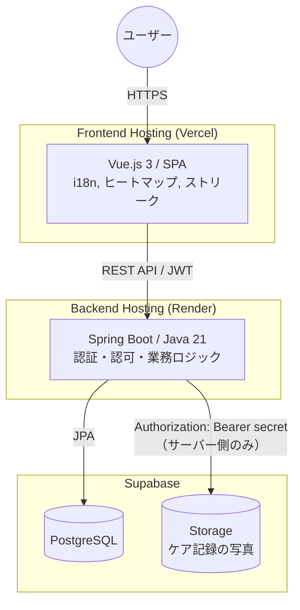

# 🌱 Garden Care Tracker

*他の言語で読む: [English](README.md), [日本語](README.ja.md)*

家庭菜園の植物とケア記録（水やり・肥料・収穫）を管理し、ヒートマップとストリークで可視化するWebアプリです。Spring Boot/Java製のREST APIをシステムの中核に置き、Vue 3製のSPAフロントエンドと組み合わせたバックエンド主導の構成になっています。

🚀 **[ライブデモ](https://garden-app-web-dun.vercel.app)**
🔗 **APIエンドポイント:** `https://garden-app-odmi.onrender.com`
📘 **[Swagger UI](https://garden-app-odmi.onrender.com/swagger-ui/index.html)**

---

## 🎯 主な機能

- **JWT認証:** BCryptによるパスワードハッシュ化と、サーバー側にセッション状態を持たないステートレスな認証。
- **所有者ベースの認可:** 認証（誰であるか）だけでなく、植物・ケア記録の操作1件ごとにサービス層で「そのリソースが本当にリクエストしたユーザーの所有物か」を検証（`requireOwner`）。有効なトークンを持っているだけでは他人のデータを操作できない設計。
- **DTOによる境界:** コントローラーからエンティティを直接返すことは一切なく、必ずレスポンスDTOに詰め替えて返却。パスワードハッシュなどの内部フィールドがAPI経由で意図せず漏洩することを構造的に防止。
- **アップロードのプロキシ処理:** 写真はサーバー側でMIMEタイプ・サイズ（5MB上限）を検証した上でSupabase Storageへアップロード。ストレージのシークレットキーはクライアントに一切渡さない。
- **無停止のスキーマ進化:** Flywayによるバージョン管理されたマイグレーション。本番のネイティブPostgres ENUM型を、再構築なしに `ALTER TYPE ... ADD VALUE` で拡張した実績あり。
- **自動テストスイート:** サービス層のビジネスロジックと認可のエッジケース（所有者違い、植物とログの紐付け不一致、不正なアップロードなど）をカバーする4テストクラス・約800行。
- **6言語i18n対応:** 外部ライブラリを使わず自作のVueコンポーザブルで、日本語・英語・中国語（簡体字／繁体字）・韓国語・タイ語にフルローカライズ。
- **データ可視化:** ケア記録を年間ヒートマップと連続日数（ストリーク）に集計して表示。

---

## 🛠 技術スタック

### バックエンド (`garden-app-api`)

| | |
|---|---|
| 言語 | Java 21 |
| フレームワーク | Spring Boot 3 |
| セキュリティ | Spring Security, JWT (jjwt), BCrypt |
| データアクセス | Spring Data JPA / Hibernate |
| マイグレーション | Flyway |
| APIドキュメント | springdoc-openapi / Swagger UI |
| ホスティング | Render |

### フロントエンド (`garden-app-web`)

| | |
|---|---|
| フレームワーク | Vue.js 3 (Composition API) |
| 状態管理 | Pinia |
| ルーティング | Vue Router |
| HTTP通信 | Axios |
| ホスティング | Vercel |

### インフラ

| | |
|---|---|
| データベース | PostgreSQL (Supabase) |
| ファイルストレージ | Supabase Storage |
| CI | GitHub Actions（フロントLint/Build＋バックエンドテスト） |
| コンテナ化 | Docker |

---

## 🏗 システムアーキテクチャ



---

## 🧱 バックエンド設計のポイント

`Controller → Service → Repository` のレイヤードアーキテクチャを採用。認可ロジックは `@PreAuthorize` アノテーションだけに頼らず、意図的に**サービス層**に明示的に実装しています。これにより「ケア記録は、認証中のユーザーが所有する植物に紐づいている必要がある」といった所有権ルールを、HTTP/Securityの関心事から分離した形で単体テスト可能にしています。

```
Controller   → リクエスト/レスポンスのマッピング、入力検証
Service      → 業務ロジック＋所有権チェック（requireOwner）
Repository   → Spring Data JPA、Postgresネイティブ ENUM 型のマッピング
Security     → JwtFilter → SecurityContext → getCurrentUsername()
```

`Plant` や `CareLog` に触れる各サービスメソッドは、処理が連鎖する場合でも所有権を都度再検証します（例：ケア記録への写真アップロードでは、まずそのケア記録がURL上の植物に紐づいているかを確認し、続けてその植物が現在のユーザーの所有物かを確認する、という2段階の検証を行う）。

---

## ✅ テスト

| テストクラス | 行数 | 内容 |
|---|---|---|
| `CareLogServiceTest` | 440 | CRUD、所有権チェック、写真アップロードの検証（サイズ／MIME） |
| `PlantServiceTest` | 219 | CRUD、所有権チェック |
| `AuthServiceTest` | 116 | 登録・ログインフロー |
| `JwtUtilTest` | 53 | トークンの生成・検証 |

CIでは `mvn test` を実DBである管理型Postgres（Supabase）に対して実行しているため、モックやインメモリDBではなく、ネイティブENUM型やFlyway適用後の実際のスキーマ挙動までテストで検証しています。

---

## 📈 CI/CDとデプロイ

| | ホスティング | デプロイトリガー |
|---|---|---|
| フロントエンド | Vercel | `main` ブランチへのPushで自動デプロイ |
| バックエンド | Render | `main` ブランチへのPushで自動デプロイ |

統合されたGitHub Actionsワークフロー（`.github/workflows/ci.yml`）により、pushのたびにフロントエンドのLint/Buildとバックエンドのテストが実行されます。

> **注記:** 現状、テストとデプロイは独立して動作しています。CIの合格はデプロイの条件にはなっていません。

---

## 💡 技術選定の理由

- **VueをReactではなく採用:** [ダーツ物理シミュレーター](https://github.com/haku3782)プロジェクトで既にReactを使用しているため、技術的制約ではなく「複数フレームワークを扱える」ことを示す意図でVueを選択。
- **Spring Boot:** 単純なCRUDの実装に留まらず、レイヤードアーキテクチャ・認可ロジック・スキーママイグレーション・テストカバレッジといった、バックエンド設計力そのものを示すために採用。
- **JWT＋ステートレス認証:** フロントとバックが別ドメイン（Vercel／Render）にホスティングされる構成に自然に適合。
- **Supabase:** データベースサーバーの構築・パッチ運用をせずに、無料枠でPostgres＋オブジェクトストレージの組み合わせを利用できる。
