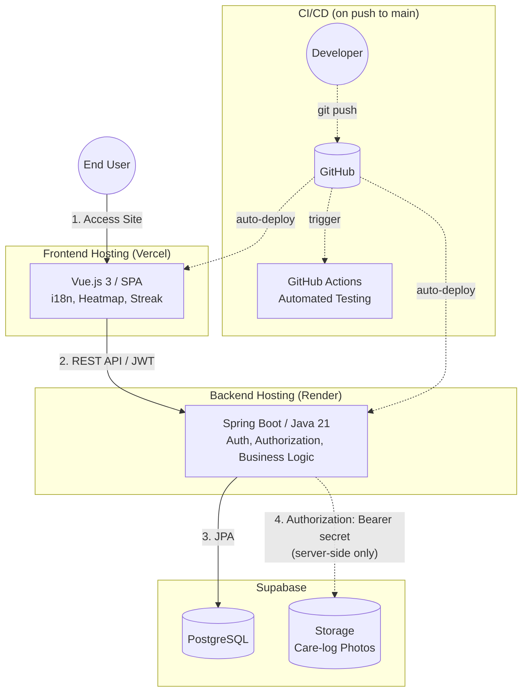

# 🌱 Garden Care Tracker

*Read this in other languages: [English](README.md), [日本語](README.ja.md)*

A backend-driven web application for tracking home garden plants and their care history (watering, fertilizing, harvesting), visualized through heatmaps and streak counters. Built with a Spring Boot/Java REST API as the core of the system, paired with a Vue 3 SPA frontend.

🚀 **[Live Demo](https://garden-app-web-dun.vercel.app)**
🔗 **API Endpoint:** `https://garden-app-odmi.onrender.com`
📘 **[Swagger UI](https://garden-app-odmi.onrender.com/swagger-ui/index.html)**

---

## 🎯 Key Features

- **JWT Authentication:** Stateless auth with BCrypt password hashing; no server-side session state.
- **Ownership-Based Authorization:** Authentication alone isn't enough — every plant/care-log operation is checked at the service layer to ensure the resource actually belongs to the requesting user (`requireOwner`), not just that *some* valid token was presented.
- **DTO Boundary:** Entities are never returned directly from controllers. Every entity is mapped to a response DTO, so internal fields (e.g. password hashes) can never leak through the API by accident.
- **Proxied File Uploads:** Photos are validated server-side (MIME type, 5MB limit) and uploaded to Supabase Storage through the backend — the storage secret key is never exposed to the client.
- **Zero-Downtime Schema Evolution:** Versioned Flyway migrations, including an `ALTER TYPE ... ADD VALUE` migration that extends a native Postgres ENUM in production without a destructive rebuild.
- **Automated Test Suite:** 4 test classes (~800 lines) covering service-layer business logic and authorization edge cases (wrong owner, mismatched plant/log relationships, invalid uploads).
- **6-Language i18n:** Frontend UI fully localized (Japanese / English / Chinese / Traditional Chinese / Korean / Thai) via a custom Vue composable, with no external i18n library.
- **Data Visualization:** Care history aggregated into a yearly heatmap and a consecutive-day streak counter.

---

## 🛠 Tech Stack

### Backend (`garden-app-api`)

| | |
|---|---|
| Language | Java 21 |
| Framework | Spring Boot 4 |
| Security | Spring Security, JWT (jjwt), BCrypt |
| Data Access | Spring Data JPA / Hibernate |
| Migrations | Flyway |
| API Docs | springdoc-openapi / Swagger UI |
| Hosting | Render |

### Frontend (`garden-app-web`)

| | |
|---|---|
| Framework | Vue.js 3 (Composition API) |
| State | Pinia |
| Routing | Vue Router |
| HTTP | Axios |
| Hosting | Vercel |

### Infrastructure

| | |
|---|---|
| Database | PostgreSQL (Supabase) |
| File Storage | Supabase Storage |
| CI | GitHub Actions (frontend lint/build + backend tests) |
| Containerization | Docker |

---

## 🏗 System Architecture



---

## 🧱 Backend Design Highlights

A classic layered architecture (`Controller → Service → Repository`), with authorization deliberately placed in the **service layer** rather than left to `@PreAuthorize` annotations alone — this keeps ownership rules (e.g. "a care log must belong to a plant that belongs to the authenticated user") explicit and unit-testable in isolation from HTTP/Security concerns.

```
Controller   → request/response mapping, validation
Service      → business logic + ownership checks (requireOwner)
Repository   → Spring Data JPA, native Postgres ENUM mapping
Security     → JwtFilter → SecurityContext → getCurrentUsername()
```

Each service method that touches a `Plant` or `CareLog` re-verifies ownership independently, even when chained (e.g. uploading a photo to a care log first confirms the care log belongs to the plant in the URL, *then* confirms the plant belongs to the current user).

---

## ✅ Testing

| Test class | Lines | Focus |
|---|---|---|
| `CareLogServiceTest` | 440 | CRUD, ownership checks, photo upload validation (size/MIME) |
| `PlantServiceTest` | 219 | CRUD, ownership checks |
| `AuthServiceTest` | 116 | Registration / login flows |
| `JwtUtilTest` | 53 | Token generation/validation |

CI runs `mvn test` against a real managed Postgres instance (Supabase), so tests exercise actual native-ENUM and Flyway-migrated schema behavior — not a mocked or in-memory DB.

---

## 📈 CI/CD & Deployment

| | Hosting | Trigger |
|---|---|---|
| Frontend | Vercel | Auto-deploy on push to `main` |
| Backend | Render | Auto-deploy on push to `main` |

A unified GitHub Actions workflow (`.github/workflows/ci.yml`) runs frontend lint/build and backend tests on every push.

> **Note:** Testing and deployment are currently independent — a deploy is not gated on CI passing.

---

## 💡 Design Rationale

- **Vue.js over React:** React was already used in the [Darts Physics Simulator](https://github.com/haku3782) project — Vue was chosen here deliberately to demonstrate range across frontend frameworks, not because of a technical constraint.
- **Spring Boot:** Chosen to demonstrate depth in backend design — layered architecture, authorization logic, schema migrations, and test coverage — rather than just CRUD wiring.
- **JWT + stateless sessions:** A natural fit for a frontend/backend split across two different hosting domains (Vercel / Render).
- **Supabase:** Gives a managed Postgres + object storage combo on a free tier, without needing to run and patch a database server.
